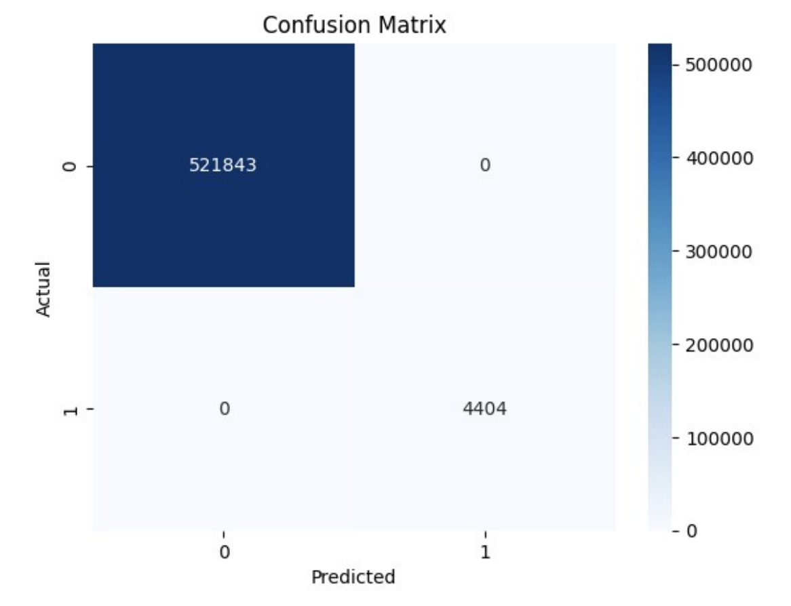

# Fraud Detection

## Objective
The objective of this project is to develop a model that can accurately detect fraudulent transactions based on features such as transaction amount, customer ID, terminal ID, and more.

## Dataset
The dataset includes various features for transactions that help in identifying fraud cases. Key columns include transaction identifiers, amounts, timestamps, and indicators of whether a transaction was fraudulent.

### Features:
- **TRANSACTION_ID**: Unique identifier for each transaction
- **TX_DATETIME**: Date and time of the transaction
- **CUSTOMER_ID**: Unique identifier for each customer
- **TERMINAL_ID**: Unique identifier for each terminal
- **TX_AMOUNT**: Amount of the transaction
- **TX_TIME_SECONDS**: Time in seconds of the transaction during the day
- **TX_TIME_DAYS**: Time in days since the start of the dataset
- **TX_FRAUD**: Target variable indicating whether the transaction was fraudulent (1) or not (0)
- **TX_FRAUD_SCENARIO**: Code representing different fraud scenarios

### Additional Features:
Derived features such as:
- **TX_DAY, TX_MONTH, TX_YEAR, TX_HOUR**: Extracted from TX_DATETIME for more granular time-based analysis

## Approach
### Data Preprocessing:
- **Handling Missing Values**: Verified no missing values were present.
- **Feature Engineering**: Converted categorical columns (CUSTOMER_ID, TERMINAL_ID) to numeric, and extracted day, month, year, and hour from TX_DATETIME.
- **Scaling**: Standardized numerical features using **StandardScaler** to improve model performance.

### Splitting Data:
The dataset was split into training and testing sets with a 70-30 split.

## Modeling
A **RandomForest Classifier** was employed for detecting fraud. The model was trained and evaluated on scaled features.

### Model Evaluation:
- **Accuracy**: Achieved an accuracy of 100% on the test set.
- **Confusion Matrix**:
            precision    recall  f1-score   support

       0       1.00      1.00      1.00    521843
       1       1.00      1.00      1.00      4404

accuracy                           1.00    526247

## Model Saving
The trained RandomForest model was saved as `fraud_detection_model.joblib` using **joblib** for easy deployment.

## Running the Fraud Detection System
1. Clone the repository and ensure all dependencies are installed.
2. Load the model file `fraud_detection_model.joblib`.
3. Use the model to predict fraud on new transactions by scaling the input features as done during training.

## Visualization
A heatmap of the confusion matrix was generated to illustrate the model's performance.

## Deployment
The saved model can be integrated into a real-time system to identify and flag potential fraudulent transactions based on incoming data.
